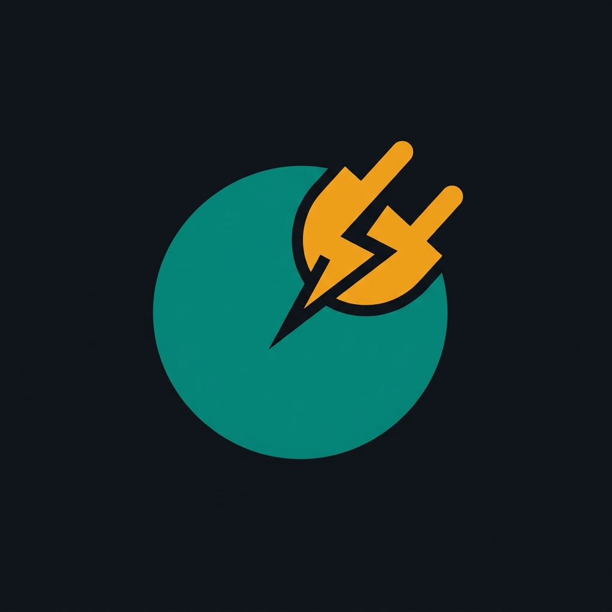

<div align="center">

<br/>



# 🔌 PlugBoot

### **Plug** any AI → **Boot** a Business Strategist, a Project Manager, a Data Analyst, a Research Director — from one portable workspace.

[](LICENSE)
[](/)
[](/)

<br/>

> A persistent, structured operating layer that gives **AGI-level Autonomy** to any agent —
> Claude Code, Gemini CLI, Cursor, Codex, any harness.
>
> For every **AI power user** who's done starting from scratch.
>
> ***Did you PlugBoot your AI yet?*** 🔌

</div>


---

## The problem

You have powerful AI. You also have a dozen projects, competing priorities, research piling up, and no way to make the AI *remember* what it worked on last Tuesday.

Every session starts from scratch. Every plan lives in a chat window. Every decision evaporates.

---

## The solution

PlugBoot is a **portable workspace** you clone once and point any AI at. The AI lands in it and becomes a persistent, structured project manager that works *for you* — not for itself.

- **It remembers everything.** Plans, decisions, missions, research, toolboxes, and events all live in YAML files on your disk — not in the AI's context window. Resume any session in seconds.
- **It works with any AI.** Claude Code, Gemini CLI, Codex, Cursor, Hermes, Antigravity, any harness. The AI is a layer *below* the workspace. PlugBoot borrows the AI's reasoning; the workspace owns the state.
- **It scales across projects.** One workspace, unlimited projects. Each project gets its own board, missions, toolboxes, inbox, and data folder. Switch between them from a live dashboard.
- **It runs in your browser.** A single Python process serves both a sync engine and a real-time dashboard. No cloud, no account, no subscription.

---

## Who it's for

| You are... | PlugBoot gives you... |
|---|---|
| A **business owner** managing growth, ops, and content | A structured project manager that never forgets |
| A **project manager** coordinating multiple streams | A living mission board with planning + execution lanes |
| A **data analyst** juggling research and client deliverables | An inbox system that organizes external data into pillars |
| An **AI power user** tired of starting fresh every session | Persistent memory that survives context windows |

A "project" can be anything: a business, a YouTube channel, a codebase, a legal-document workflow, a multi-account content operation.

---

## What's inside

```
PlugBoot/
  AGENTS.md          Agent boot authority — every harness reads this first
  config.yaml        Global control: which entities are active, automation levels
  index.yaml         Workspace map — every path, every entity, one file

  _os/               THE ORCHESTRATOR (always on)
    os-board.md      Your OS identity and notes
    os-runtime.yaml  Live pillars, queues, objectives
    os-missions.yaml Standard / research / evolution missions
    os-toolboxes.yaml Toolbox registry
    os-inbox.yaml    Inbox + gateway tracker
    os_prompts/      10 hard laws the AI operates by
    os-inbox/        Raw data drops + .<entity>-inbox_gateway/

  your-project/      A PROJECT (repeat for each one)
    *-board.md       Project identity
    *-runtime.yaml   Live pillars and queues
    *-missions.yaml  All missions for this project
    *-toolboxes.yaml Toolboxes for this project
    *-inbox.yaml     Inbox tracker
    *-data/          Anything: code, docs, research, spreadsheets

  .infra/
    backend/         Sync daemon + dashboard server (Python, Starlette)
    frontend/        Dashboard UI (htmx + Alpine + Cytoscape — no build step)
    schemas/         YAML contracts (the law)
    templates/       Board + mission templates
```

---

## The three systems

### 1. Missions
Three kinds of structured work:

- **Standard** — goals + ordered tasks. Supports rounds (repeating/persistent) for recurring workflows.
- **Research** — parameterized investigation. Set depth/detail/precision levels and sources (training data, web, YouTube, NotebookLM). Outputs topic trees with keywords and instructions.
- **Evolution** — the AI improves the workspace itself. Four modes: **FAST** (realtime intent), **DEEP** (full entity analytics), **RESEARCH** (from prior research), **INBOX** (from your data drops). Every run is gated by a readiness check so nothing advances until you approve.

### 2. Inbox & Gateway
Drop any file into a project's inbox folder — competitor research, reference docs, source data, anything. PlugBoot organizes it into a gateway under your project's pillars so the AI can find and act on it without re-reading everything every time.

### 3. Toolboxes
Register agents and skills in a domain → toolbox → agent/skill hierarchy. Control what's active from the dashboard. The AI only uses what you've turned on.

---

## Quick start

```bash
# 1. Clone
git clone https://github.com/Auto-Skiller/plugboot.git my-workspace
cd my-workspace

# 2. Install dependencies
pip install -r .infra/backend/requirements.txt

# 3. Start the dashboard
python .infra/backend/daemon.py
# → Dashboard at http://localhost:8000

# 4. PlugBoot your AI
# Open the workspace folder in Cursor, Claude Code, Gemini CLI, etc.
# The AI reads AGENTS.md and boots automatically.
# That's it. You just PlugBooted your AI. 🔌
```

---

## Design principles

- **Workspace owns state.** Everything lives in YAMLs on your disk. The AI is a visitor, not the owner.
- **Brain-first reading.** YAMLs pre-describe every file so the AI picks up context without re-reading everything.
- **No locks, no complexity.** Simple writes, git is recovery.
- **Content-aware sync.** The daemon only writes files when real content changes — zero disk churn when nothing moves.
- **One process.** The sync daemon and dashboard server are a single Starlette process. No microservices, no orchestration layer.
- **Convention now, MCP later.** The harness bridge is convention-based today. A future MCP layer will expose the same read/write points as tools — without changing the model.

---

## Pillars vs Aspects

Two concepts that steer all AI work:

- **Pillars** are *yours*. Defined per project in its runtime YAML. They describe what matters to that project (e.g. "Audience Growth", "Revenue", "Operations").
- **Aspects** are *fixed*: **Architecture**, **Capabilities**, **Monetization**. They steer evolution and research runs so the AI focuses on the right dimension of improvement.

---

## Roadmap

- [ ] MCP adapter layer (expose workspace as tools to any harness)
- [ ] Multi-user mode (shared workspace, per-user audit trail)
- [ ] NotebookLM gateway integration
- [ ] Hosted dashboard option (for teams without local Python)
- [ ] Project templates (e-commerce, content ops, SaaS, legal)

---

## Contributing

This project is in active development. Issues and PRs welcome. If you PlugBoot something interesting, open a discussion — we'd love to feature it.

---

<div align="center">

**🔌 PlugBoot — Plug any AI. Boot a project manager.**

</div>
